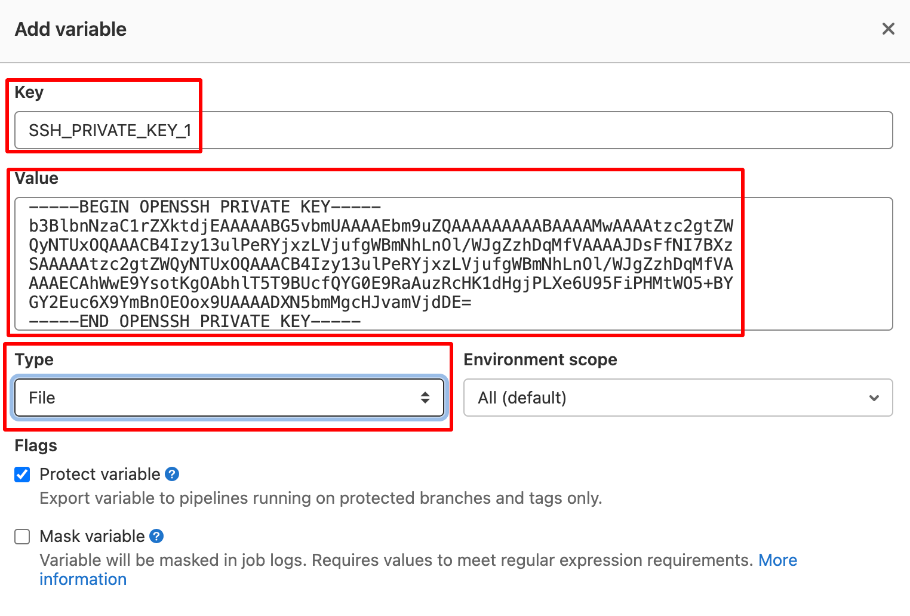

# Polling / sync projects to your gitlab server 
這個 GitLab CI 的 tempalte 可讓客戶用來同步奔騰專家服務的工作產出到客戶自己的 gitlab 服務上

# Prerequsite 
這個專案假設您已經熟悉:
1. 設定 Gitlab CICD pipeline
2. 在 Gitlab 內管理 secrets
3. 基本的 git 操作

# Sync projects

## 複製同步專案 exporter 到 gitlab 內
1. 建立一個存放 exporter 跟同步來的專案的 group
2. 新增一個專案，點選 "Import project" 匯入
3. 選擇 "Repo by URL", and 在 "Git repository URL" 欄位裡面填入 "https://github.com/pnexpert/exporter-template-gitlab" 
4. "Project Name" 欄位裡面填入專案名稱 (我們建議使用 exporter-gitlab)
5. 在 "Project Url" 裡面的選單裡面，選擇剛剛建立的 group
6. 按下 "Create project" 按鈕開始匯入

## 從 Pentium Network 取得專案名稱
1. 與您的奔騰專家服務 PM 窗口聯繫取得工作產出的 repo ID

## 準備 SSH key pairs
1. 建立 ssh key pairs，接著把 public key 送給 Pentium Network，[範例](https://docs.gitlab.com/ee/ssh/#generate-an-ssh-key-pair):

<pre>ssh-keygen -t ed25519 -C "sync [要 sync 的專案名稱]"</pre>

2. 把 private key 儲存在 gitlab 內 (Exporter 專案的 Settings > CI / CD > Variables)
3. 新增 variable，內容為:

<pre>
Key: SSH_PRIVATE_KEY_[流水號]
Value: [private key 的檔案內容]
Type: File
</pre>

範例:

4. 等待奔騰專家服務通知您已設定完成

## 準備 gitlab API token
1. 選擇或建立一個使用者，exporter 會以該使用者的權限運作
2. 打開使用者的 User settings > Access Token
3. 新增一個 personal access token，內容會包含:

<pre>
Name: token 名稱 (可以寫 exporter 用)
勾選權限:
api, read_repository, and write_repository
</pre>

4. Store secrets in gitlab (Settings > CI / CD > Variables)
5. 新增 variable，內容為:

<pre>
Key: gitlab_user
Value: id of the user
Type: Variable
</pre>

6. 新增 gitlab_token 的 variable，內容為:

Add gitlab_token, Key: gitlab_token, Value: <the created token>, type: Variable

## 設定 Gitlab pipeline
1. 建立 config 檔案 (可以複製 [config.csv-dist](config.csv-dist), 把檔名奤成 config.csv，然後填入設定，格式為:

[repo name],[private key 使用的環境變數名稱]

舉例來說，
奔騰專家服務提供了兩個 repo IDs，分別為 __demo_repo__ 以及 __sample_repo__ 
您在前面的 Gitlab Variable 分別設定了 __SSH_PRIVATE_KEY_1__ 和 __SSH_PRIVATE_KEY_2__

config.csv 就會如下:

<pre>
demo_repo,SSH_PRIVATE_KEY_1
sample_repo,SSH_PRIVATE_KEY_2
</pre>

2. 到 pipeline 去測試剛剛的設定
3. 設定 pipeline schedule 的排程執行頻率，即可自動排程拉取

Happying syncing!
